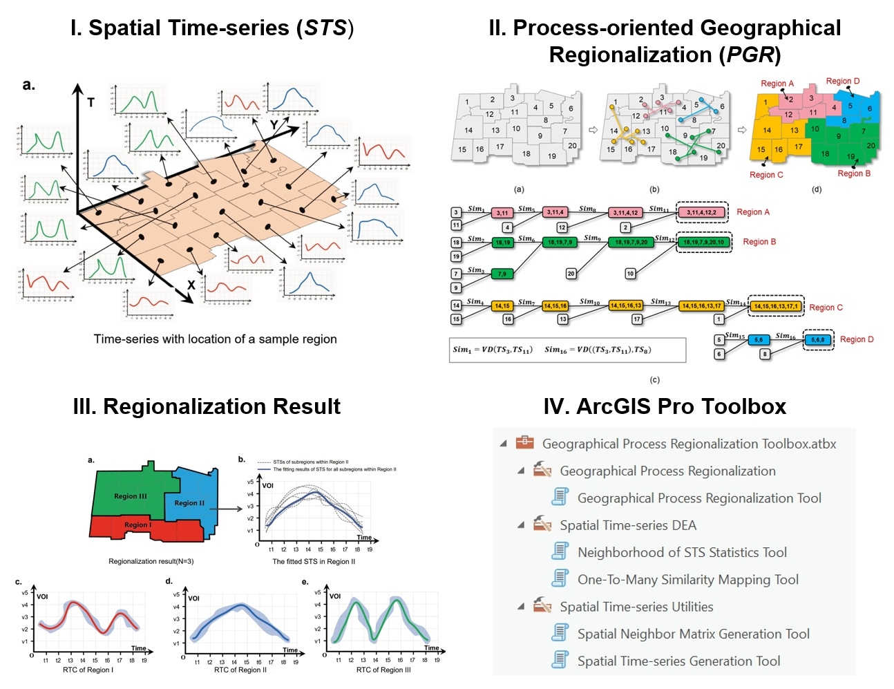

## Source code and ArcGIS Pro Toolbox for Process-oriented Geographical Regionalization
Process-oriented geographical regionalization is a novel paradigm for delineating regions based on geographical processes. It involves merging spatially adjacent areas with similar geographical processes while separating areas with dissimilar processes. The ultimate goal is to divide the entire study area into multiple subregions, where each subregion exhibits relatively homogeneous geographical processes internally, while different subregions display heterogeneous processes. This approach ensures that within each subregion, geographical processes are similar, but between subregions, these processes are distinct. This concept forms the fundamental principle of process-oriented geographical regionalization.

# Process-oriented Geographical Regionalization

## Overview

This repository provides resources for process-oriented geographical regionalization, including:

- Source code
- ArcGIS Pro toolbox
- Test data

Users can either:
1. Reference and use the source code directly
2. Utilize the provided toolbox to execute their own process-oriented geographical regionalization tasks

## Implementation Principles

The implementation principles of the process-oriented geographical regionalization model and tools are detailed in the following literature:

## References

> Zhang, H., Zhou, X., Wang, H., Yang, Y., Ye, X., & Tang, G. (2024). Advancing process-oriented geographical regionalization model. Annals of the American Association of Geographers. DOI: [10.1080/24694452.2024.2380893](https://doi.org/10.1080/24694452.2024.2380893)

## Contents in repository

1. **Code_for_Calculating_Silhouette_Coefficient, Data_for_calculating_the_silhouette_coefficient_of_the_result**: Theoe are the original source code and data corresponding to the paper.
2. **Toolbox for ArcGIS Pro**: This includes the ArcGIS Pro toolbox for geographical process regionalization, the implementation code for the tools, and test data. The code here has been optimized for both efficiency and accuracy of the algorithm.We encourage users to refer to the code provided here rather than the original version.

## Graphic abstract

## Contact

For questions or feedback, please [contact us](mailto:zhanghaiping@igsnrr.ac.cn).
